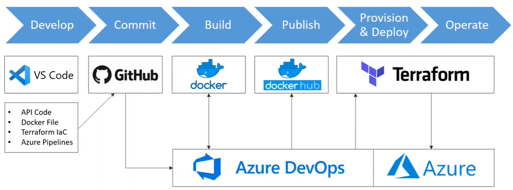
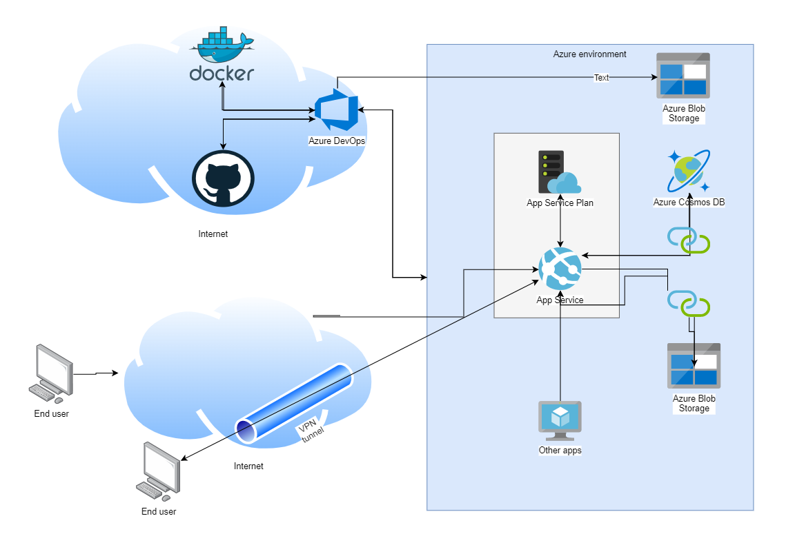

# ToDo - WebApp API 

This project contains the code of a ToDo ASP.NET Core app, the yml file used for the Azure DevOps build and deployment pipeline and the Terraform files needed in order to create the infrastructure for the app.

# Scope

The scope of this project is to create a CI/CD pipeline for an app which has to be able to connect to a storage account and to a database.
The solution has to take into consideration security best practices, scalability and cost control.

# Shoping list
API code - https://github.com/Azure-Samples/dotnet-core-api
GitHub account - free
Docker Hub account - free
Terraform - free
Azure DevOps account - free
Azure subscription - free tier available for 30 days

## Workflow

## Technologies
For this project I chose to use the following Azure services because of the key benefits that each one provides:
- App service / App service plan - auto-scaling, high availability and enables automated deployments
- Azure Storage account / Azure Blob Storage - optimized for storing massive amounts of unstructured data
- Azure Cosmos DB for NoSQL - Fully managed and cost-effective
- Azure DevOps - CI/CD

## Manual actions

Before implementing a CI/CD pipeline for this project there are some configurations that (for the moment) have to be done manualy, like:
- Creating a service principal which is going to be used by Azure DevOps to authenticate to the  Azure subscription. Can be done by running the Powershel script ./Infrastructure/Manual - One time actions/Create service principal for Azure DevOps.ps1
- Creating the Service connection towards the Azure subscription.
- Creating the Azure Storage account where Terraform is going to store the *terraform.tfstate* file.
- Create the Service connection towards the Docker Hub.

## Security considerations

Minimum TLS version 1.2 is enforced on all resources.

The FTP/FTPS is disabled on the App Service.

Azure Active Directory can be enabled on the App Service in order to restrict the access to the application only for the restricted internal users.

The App Service plan is now set to a Production plan. In order to increase the security it could be increased to an App Service Environment, where the compute resources would be isolated in a dedicated VNET and we could also use an Azure Application Gateway or any other WAF from the Azure Marketplace in order to increase the security of the application.

By using service connectors from the App Service to the Azure Cosmos DB database and  the Azure Storage account all communications are encrypted by default though the Azure backbone network, without any exposure on the internet.

The App Service is protected from malwares, DDOS, man-in-the-middle attacks by the Azure threat management systems.

The public connectivity to the storage account could be restricted and a private endpoint connection can be created instead, therefore the traffic towards the storage account would only cross the VNET and the private link Azure backbone network.

## Scalability and cost control considerations
Any application has an expected threshold of usage, but there might be also cases when a lot more users want to use the application. This might lead to maxing out the resources available on the instances of application running at that moment.

In order to provide a better experience, but in the same time keep the costs under control, not spending too much on something that nobody is using I introduced an autoscaling profile on the App Service, based on CPU and memory metrics. The autoscalling is adding a new instance of compute if the metrics are above the threshold set, but in case they get lower than a specified level then the number of instances is reduced gradually until it reaches the optimal level.

By using the Azure Cosmos DB the costs ar kept to a minimum as we pay only for what we use and we can benefit of a service managed by Azure.

## Architecture

